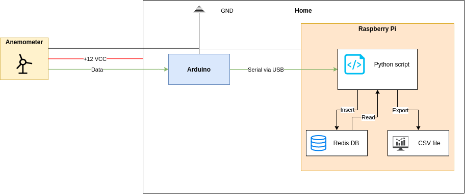

# windData
This project aims to read data from a wind speed transmitter (DC 10-30V / analog 0-5V output), and store the values in a database for further analysis.


## Arduino
Load the following script into the Arduino Nano board :
```
src/arduino/anemometer.ino
```
## Raspberry Pi
### 1) Install Redis database
Follow the instructions here: https://pimylifeup.com/raspberry-pi-redis/

### 2) Install required Python packages
```
pip -r requirements.txt
```